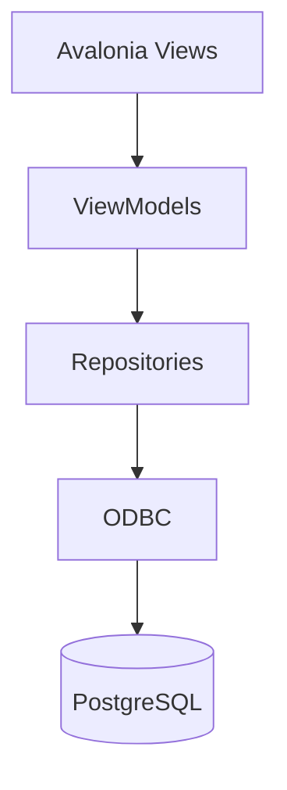

# Pharmacy Management System


A cross-platform desktop application for managing the daily work of a local pharmacy. The system covers medicine records, customers, prescriptions, compounded medicines, inventory, deliveries, supplier orders, sales documents, reports, audit logs and database backups.

The project was developed as a **group university project at Wroclaw University of Science and Technology** for a database systems course. It combines a C# desktop client built with **Avalonia UI** and a relational **PostgreSQL** database accessed through ODBC.

## Authors

- Robert Tworek
- Kacper Wajda
- Michal Gladkojc

## Screenshots

### Login and database connection

The login screen allows the user to authenticate and configure or test the local PostgreSQL/ODBC connection.


### Role-based dashboard

The main dashboard exposes pharmacy modules through a simple desktop navigation view.


### Customer records

The customer module supports browsing, filtering and maintaining customer data, including contact details and PESEL handling.


### Sales workflow

The sales module handles medicine selection, stock batches, cart items and sales documents such as receipts and invoices.


### Reports and administration

The reporting area contains sales, inventory, alerts, audit logs, CSV export and backup/restore actions.


## What The Project Shows

This repository is meant to demonstrate practical work with a real business-style desktop application, not only isolated CRUD screens. The application includes:

- a desktop UI built with Avalonia and the MVVM pattern;
- PostgreSQL schema design with migrations, constraints, views, triggers and roles;
- repository-based data access through ODBC;
- role-based access for a pharmacy manager and a pharmacist;
- input validation and user-readable error handling;
- protection of sensitive customer data;
- operational features such as audit logs, backups, CSV exports and test scripts;
- packaging scripts for Windows x64 and macOS Apple Silicon.

## Main Features

| Area | Implemented Scope |
| --- | --- |
| Authentication | Demo accounts, role detection, optional connection test and saved local database settings |
| Customers | CRUD for customers, addresses and phone numbers, PESEL validation, masking and encrypted storage |
| Medicines | Products, producers, variants, dosage, form, EAN codes, suppliers and search/filtering |
| Inventory | Medicine batches, raw material batches, stock corrections, reserved stock, expiry dates and low-stock alerts |
| Prescriptions | Prescription records and links between customers, doctors, sold medicines and prescription documents |
| Compounding | Recipes for prepared medicines, ingredients, raw materials, batch usage and execution records |
| Sales | Receipts, invoices, cart workflow, batch selection and automatic stock reduction |
| Deliveries | Deliveries for medicines and raw materials, order links, stock increases and manager-level correction flow |
| Orders | Manual orders, generated replenishment proposals, statuses, archiving and mixed product/raw-material lines |
| Reports | Sales reports, inventory reports, alerts, audit log preview and CSV export |
| Administration | User accounts, active status, roles, password changes and database-level permissions |
| Backup | Manual database backup and controlled restore from the reports module |

## Technologies

- C# / .NET `net10.0`
- Avalonia UI
- CommunityToolkit.Mvvm
- Material.Icons.Avalonia
- PostgreSQL
- ODBC / `System.Data.Odbc`
- SQL migrations, seed data and smoke tests
- Bash and PowerShell setup/package scripts

## Architecture



The application keeps the UI, view state and database access separated. Views define the desktop interface, ViewModels handle user actions and state, repositories execute SQL operations, and PostgreSQL stores the business data with constraints, triggers, roles and reporting views.

## Database Design

The database is organized into three logical schemas:

| Schema | Responsibility |
| --- | --- |
| `apteka` | medicines, customers, doctors, prescriptions, sales and compounded medicine records |
| `magazyn` | suppliers, deliveries, inventory batches, raw materials and orders |
| `uzytkownicy` | users, roles, permissions and audit logs |

The database layer includes:

- normalized relational tables with primary and foreign keys;
- `NOT NULL`, `UNIQUE` and `CHECK` constraints;
- indexes for frequently searched fields;
- views for reports and operational summaries;
- triggers for audit logging;
- separate PostgreSQL roles for manager and pharmacist workflows;
- migrations from the initial schema to the final extended version;
- demo seed data and a smoke regression test.

## Security And Data Protection

The application includes several mechanisms that are important for a pharmacy-like domain:

- user passwords are stored as hashes;
- customer PESEL values are encrypted before saving;
- a separate PESEL hash is used for uniqueness checks;
- sensitive values can be masked in the UI depending on role and context;
- manager and pharmacist roles are separated both in the application and in PostgreSQL;
- key operations are written to audit logs;
- database restore requires explicit confirmation.

For a real deployment, the demo passwords and demo sensitive-data key must be replaced before storing real data.

## Project Structure

```text
pharmacy-management-system/
|-- Models/              # domain models
|-- Repositories/        # ODBC/PostgreSQL data access
|-- Services/            # validation, hashing, backup and sensitive data protection
|-- ViewModels/          # UI state and application logic
|-- Views/               # Avalonia screens
|-- db/
|   |-- migrations/      # schema and permission migrations
|   |-- seeds/           # demo data
|   `-- tests/           # SQL smoke regression test
|-- docs/
|   |-- screenshots/     # selected application screenshots
|   `-- reference/       # Polish project documentation and final report
|-- scripts/             # setup, run, publish and package scripts
|-- test-results/        # final UI/package test report
|-- appsettings.json
|-- Apteka.csproj
`-- Apteka.sln
```

## Running Locally

### Requirements

- .NET SDK compatible with `net10.0`
- PostgreSQL
- PostgreSQL ODBC driver
- On Windows: `PostgreSQL Unicode` ODBC driver
- On macOS/Homebrew: `psqlodbcw.so` is usually available under `/opt/homebrew/lib/`

### Database Setup

The database scripts are stored in `db/`.

macOS:

```bash
./scripts/setup-db-macos.sh
```

Windows:

```powershell
powershell -ExecutionPolicy Bypass -File .\scripts\setup-db-windows.ps1
```

Manual setup:

```bash
createdb Apteka
for migration in db/migrations/*.sql; do psql -d Apteka -f "$migration"; done
psql -d Apteka -f db/seeds/001_demo_data.sql
psql -d Apteka -v ON_ERROR_STOP=1 -f db/tests/001_smoke_regression.sql
```

Demo accounts:

| Role | Login | Password |
| --- | --- | --- |
| Manager | `kierownik` | `kierownik123` |
| Pharmacist | `farmaceuta` | `farmaceuta123` |

### Application Start

```bash
dotnet restore
AVALONIA_TELEMETRY_OPTOUT=1 dotnet run --project Apteka.csproj
```

On macOS, the helper script can also be used:

```bash
./scripts/run-macos.sh
```

The default `appsettings.json` uses:

```json
"Driver": "auto"
```

In `auto` mode the application tries to use the Homebrew macOS ODBC driver when available, otherwise it falls back to the `PostgreSQL Unicode` driver name commonly used on Windows.

## Packaging

The project contains scripts for creating self-contained desktop builds:

macOS Apple Silicon:

```bash
./scripts/package-macos-app.sh
```

Windows x64:

```bash
./scripts/package-windows-zip.sh
```

The final submitted version produced:

- Windows x64 ZIP package;
- macOS Apple Silicon `.app`;
- macOS `.dmg`;
- database setup scripts for both platforms;
- demo database seed and SQL smoke test.

Large generated packages are better published as GitHub Releases instead of being committed directly into the repository history.

## Tests And Final Checks

The final project package was checked with:

- `.NET` build;
- SQL smoke regression test from `db/tests/001_smoke_regression.sql`;
- demo seed validation;
- encrypted PESEL storage check;
- ViewModel/screen loading check;
- Windows and macOS package generation;
- final ZIP content verification.

The detailed Polish test report is available in [test-results/ui-and-package-test-report-pl.txt](test-results/ui-and-package-test-report-pl.txt).

## Documentation

Detailed documentation is available in Polish:

- [Functional description and run guide](docs/reference/functional-description-pl.pdf)
- [Final functionality and test report](docs/reference/final-report-pl.pdf)
- [Original database project report](docs/reference/original-database-project-report-pl.pdf)

## Current Limitations

- The application is not code-signed or notarized, so Windows or macOS may show a warning on first launch.
- PostgreSQL is external by design. The project uses a local relational database, not an embedded database file.
- The macOS `.dmg` is a distribution image, not a full installer.
- Automatic scheduled backups are not included yet; backups are created manually from the reports module.
