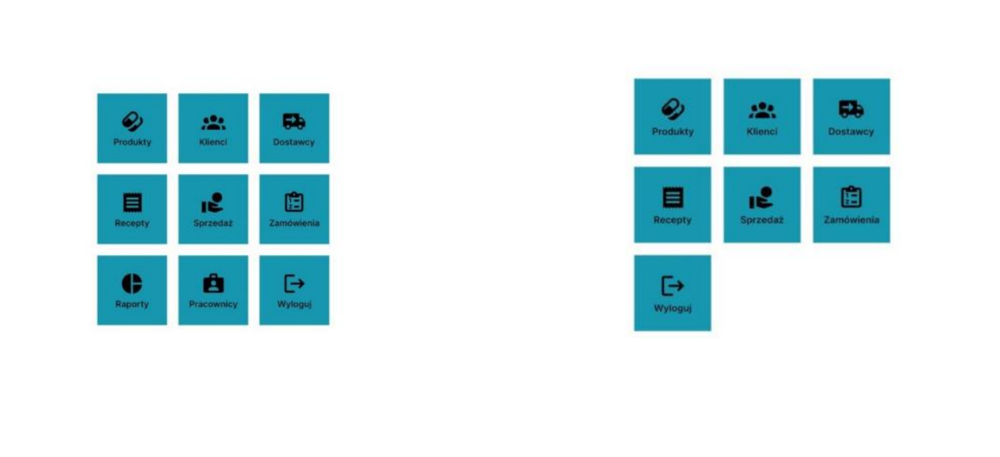
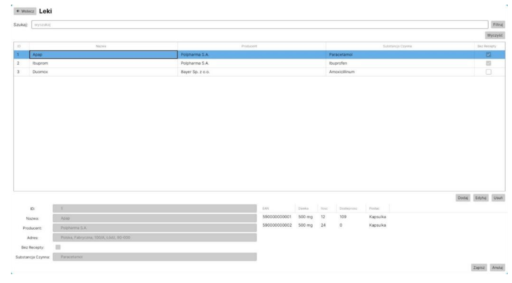
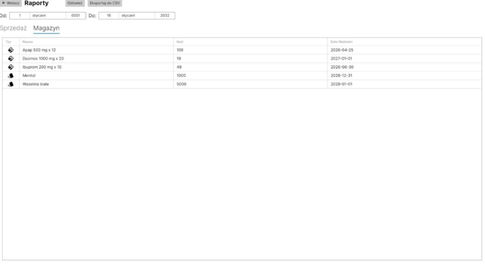
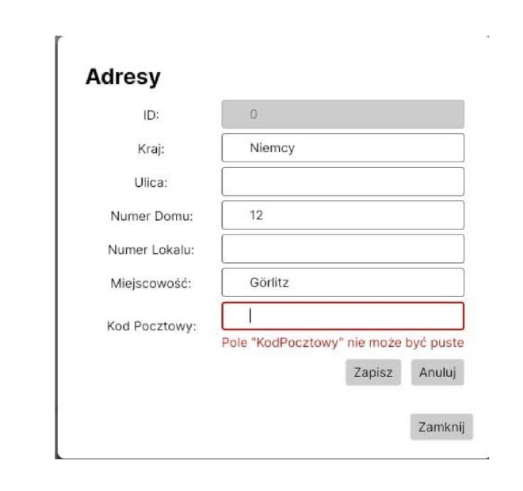
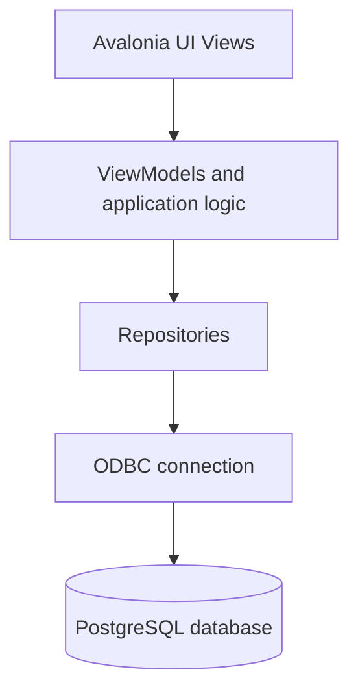

# Pharmacy Management System

A desktop application supporting the daily operations of a local pharmacy. The system was developed as a **group university project at Wrocław University of Science and Technology (Politechnika Wrocławska)** as part of a database systems course.

The client application is written in **C#** with **Avalonia UI** and communicates with a **PostgreSQL** database through ODBC. The project combines a desktop interface with a relational database model covering inventory, prescriptions, sales, deliveries, orders, reporting and role-based access.

> This is an academic portfolio project, not a production-ready medical system.

## Authors

- Robert Tworek
- Kacper Wajda
- Michał Gładkojć

## Screenshots

### Role-based dashboard

The dashboard exposes modules according to the logged-in user's role.



### Product management

The products module supports browsing and managing medicine data, variants and availability.



### Reports

The reporting module presents data retrieved from PostgreSQL reporting views.



### Input validation

The application validates user input and displays readable error messages.



## Main Features

- login flow and role-based navigation for a pharmacist and a pharmacy manager;
- management of medicines, variants, batches and pharmaceutical ingredients;
- customer, doctor, address and phone-number records;
- prescription processing for ready-made and compounded medicines;
- sales documents and warehouse stock updates;
- delivery registration, supplier management and wholesale orders;
- reporting views for inventory and daily sales;
- input validation and user-friendly error messages;
- database-side audit concept for important operations.

## Technologies

- C# / .NET
- Avalonia UI
- PostgreSQL
- ODBC
- MVVM-style application structure
- pgModeler
- pgAdmin

## Architecture



The separation keeps database access outside the UI layer and makes the codebase easier to maintain and extend.

## Database Design

The PostgreSQL database is divided into three logical schemas:

```text
apteka       - medicines, customers, doctors, prescriptions and sales
magazyn      - deliveries, suppliers, batches, ingredients and orders
uzytkownicy  - users, roles and operation logs
```

The database design includes:

- relational modelling and normalization;
- primary and foreign keys;
- `UNIQUE`, `NOT NULL` and `CHECK` constraints;
- indexes for frequently searched fields;
- reporting views;
- role-based permissions;
- functions and triggers for operation logging.

## Project Structure

```text
pharmacy-management-system/
├── Assets/
├── Models/             # domain models
├── Repositories/       # database access layer
├── Services/           # validation services
├── ViewModels/         # application logic and UI state
├── Views/              # Avalonia UI views and reusable components
├── database/           # database export placeholder
├── docs/
│   ├── screenshots/    # selected interface screenshots
│   └── reference/      # full report and presentation in Polish
├── .env.example        # example database environment variables
├── Apteka.csproj
└── Apteka.sln
```

## Documentation

Detailed documentation is available in Polish:

- [Full project report](docs/reference/project-report-pl.pdf)
- [Project presentation](docs/reference/project-presentation-pl.pdf)

The documentation includes requirements, use cases, database diagrams, normalization, integrity constraints, views, indexes, functions, triggers, security mechanisms and testing scenarios.

## Running the Application

### Requirements

- .NET SDK
- PostgreSQL
- PostgreSQL Unicode ODBC driver
- database schema and sample data matching the project model

Set the database connection variables in your shell:

```bash
export APTEKA_DB_DRIVER="PostgreSQL Unicode"
export APTEKA_DB_HOST="localhost"
export APTEKA_DB_PORT="5432"
export APTEKA_DB_NAME="Apteka"
export APTEKA_DB_USER="postgres"
export APTEKA_DB_PASSWORD="your-password"
```

Then run:

```bash
dotnet restore
dotnet run
```

## Current Limitation

The original submitted source package did not contain the final PostgreSQL schema export or demo seed data. The application source code and full project documentation are included, but a fully reproducible local setup still requires adding:

```text
database/
├── schema.sql
└── seed.sql
```

## Public Repository Cleanup

The public portfolio version removes local database connection details and avoids printing passwords or password hashes to the console. Database connection values are provided through environment variables.
